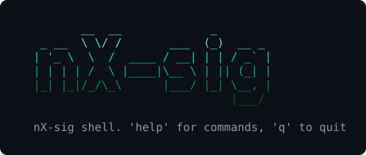

<p align="center">
  
</p>

**nX-sig** is a small terminal tool for tracking stock positions. It records
your buy and sell transactions, keeps the count and average buy price of every
stock, shows live prices and your gain or loss, and can record broker orders
automatically from the confirmation emails. It is made to run on a phone in
[Termux](https://termux.dev), so all output fits a 48-character screen.

## Features

- **Interactive shell** (`./nxshell`) to add, list and delete transactions,
  see positions with live prices and gain/loss, and keep personal trading rules
- **Live prices** from the [Alpaca](https://alpaca.markets) market data API
- **Order watcher** (`./watcher`) that waits for broker emails over IMAP and
  records FILLED orders as transactions, running in the background
- **Plain files** for storage: CSV for transactions, JSON for rules and state,
  written atomically and locked, so the shell and the watcher can run together
- **Notifications** through [ntfy](https://ntfy.sh) and Telegram (helper scripts)

## Requirements

- Python **3.12+** for the shell, **3.14+** for the order watcher
  (it uses IMAP IDLE, added to `imaplib` in 3.14)
- Python packages: `requests`, `python-dotenv` (and `rich` for `latest_trade.py`)
- An Alpaca account for prices, and an email account with IMAP access
  (e.g. Gmail with an app password) for the order watcher

## Setup

```bash
git clone https://github.com/serjhnn/nx-sig.git
cd nx-sig
pip install requests python-dotenv rich
```

In Termux, install Python and git first: `pkg install python git`.

Create a `.env` file in the repo folder with your keys (it is in `.gitignore`):

```ini
# prices (Alpaca market data)
APCA_API_KEY_ID=your-key-id
APCA_API_SECRET_KEY=your-secret-key

# order watcher (IMAP)
IMAP_HOST=imap.gmail.com
IMAP_USERNAME=you@gmail.com
IMAP_APP_PASSWORD=your-16-char-app-password
IMAP_SENDER=address-your-broker-sends-orders-from@example.com
# optional
IMAP_MAILBOX=INBOX
LOG_LEVEL=INFO

# notifications (optional)
NTFY_TOPIC=your-ntfy-topic
TOKEN=telegram-bot-token
CHAT_ID=telegram-chat-id
```

For Gmail, turn on 2-Step Verification and create an app password at
<https://myaccount.google.com/apppasswords>.

`config.json` holds the rest of the settings:

| Key | Meaning |
|---|---|
| `indices` | the stocks you track; only these can be used in commands and are recorded by the watcher |
| `storage_dir` | where data files are kept, relative to the repo folder (default `./data/`) |
| `url`, `feed` | the Alpaca latest-trades endpoint and data feed |

## Running

### The shell

```bash
./nxshell
```

It starts from the repo folder by itself, so `~/nx-sig/nxshell` works from
anywhere. Set `NXSHELL_PYTHON` to use a specific Python.

| Command | What it does |
|---|---|
| `tr add <stock> <buy\|sell> <count> <price>` | record a transaction, e.g. `tr add NVDA buy 10 120.5` |
| `tr get <stock>`, `ls <stock>` | the stock's transactions and its total |
| `ls` | count, average price and total of every stock you hold |
| `tr del-last <stock>` | show the last transaction and delete it after confirmation |
| `status` | positions with the current price and gain/loss, and the order watcher's state |
| `xtop [sec]` | live price table, updated every 5 (or `sec`) seconds, Ctrl+C to leave |
| `rules`, `rules add <rule>`, `rules delete <id>` | your personal trading rules |
| `help [command]` | all commands, or details of one |
| `exit`, `quit`, `q` | leave the shell |

`tr` is short for `transactions`. Tab completes commands and stock names.

The average price is a weighted average of your buys:
`avg = (avg × count + price × bought) / (count + bought)`. Sells lower the count
and keep the average. Gain/loss in `status` is `count × price − count × avg`.

### The order watcher

```bash
./watcher start      # run it in the background
./watcher status     # running or not, last order, last log lines
./watcher stop       # stop it cleanly
./watcher restart
```

It waits for new emails from `IMAP_SENDER`, reads the order with
`scripts/order_parser.py` and records it when its status is `FILLED` and the
symbol is in `indices`. Emails like this one are understood:

```
Symbol (Ծածկագիր) TSMX
Quantity (քանակ) 10
Executed Price (կատարման գին) 87.54
Order Type (պատվերի տեսակ) Buy  LMT  DAY
Status (կարգավիճակ) *FILLED*
```

- It remembers the last email it handled, so after a restart it picks up the
  emails it missed and never records an order twice. On the very first start it
  begins after the newest email, so old emails are not imported.
- A dropped connection is reconnected automatically.
- `./watcher` finds a Python 3.14+ by itself, or uses `WATCHER_PYTHON`.
  In Termux it takes a wake lock while it runs, so Android does not pause it.
- Logs are in `data/logs/order_watcher.log` (rotated at 1 MB, 5 files kept).
  `LOG_LEVEL=DEBUG` in `.env` logs more detail.
- If an order is found but can't be saved, the log and `status` in the shell
  show `ORDER NOT RECORDED` with the `tr add` command to add it by hand.

## Data

Everything is kept in `storage_dir` (`data/`, not in git):

| File | Contents |
|---|---|
| `<stock>_transactions.csv` | the stock's transactions: Index, Date, Time, Type, Count, Price |
| `transactions_total.csv` | count and average price of every stock |
| `personal_rules.json` | your rules |
| `mail_state.json` | the last email the watcher handled |
| `watcher_status.json` | the watcher's heartbeat, shown by `status` |
| `logs/` | the watcher's logs |

## Project layout

```
nx-sig/
├── nxshell               start the shell
├── watcher               start/stop/status of the order watcher
├── config.json           stocks, data folder, price API
├── CODE_STYLE.md         code style rules
├── assets/logo.svg
└── scripts/
    ├── commands.py       the shell and its commands
    ├── storage.py        transactions, totals, rules and watcher state on disk
    ├── trade_engine.py   latest prices from Alpaca (one-off and polling)
    ├── order_watcher.py  email -> parsed order -> transaction
    ├── mail_reader.py    IMAP IDLE watcher with reconnects
    ├── order_parser.py   reads an order from a broker email
    ├── latest_trade.py   prints the latest prices once
    ├── ntfy.py           push notification through ntfy.sh
    ├── telegram_notify.py  message through a Telegram bot
    ├── watch_notify.py   notes for a planned Garmin watch app
    └── check_style.py    checks the code style rules
```

## Tests

```bash
python scripts/storage.py        # transactions, totals, rules, locking
python scripts/order_parser.py   # order email parsing
python scripts/check_style.py    # code style (line width)
```

## Code style

The code is written to be read on a phone: lines are at most
60 characters and the shell's output at most 48. See
[CODE_STYLE.md](CODE_STYLE.md) for the rules and how to check them.

## Planned

- Growth % in `ls` (currently 0)
- `strategy` commands
- Notifications to a Garmin watch (see `scripts/watch_notify.py`)
